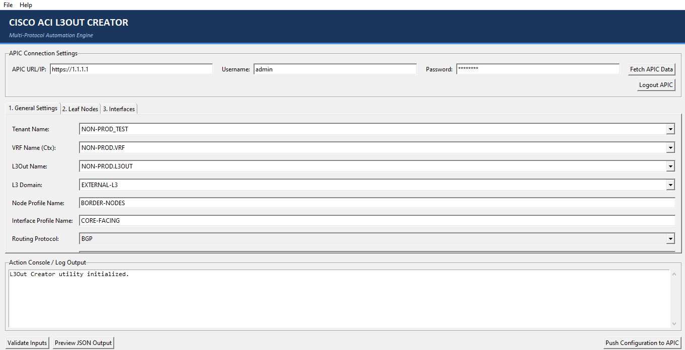

# Cisco ACI L3Out Creator (Desktop App)



Cisco ACI L3Out Creator is a Python utility designed to automate the modeling, validation, and deployment of Layer 3 Outs (L3Outs) to Cisco ACI APIC clusters. It supports multiple routing protocols (BGP, OSPF, EIGRP, and Static routing) and allows network engineers to configure leaf nodes, interface profiles, path attachments, and BGP peer profiles through a clean, multi-threaded interface.

This application can be run directly as a Python 3 script. It can be packaged as a standalone Windows executable too, if Cobra Sdk Modules are included in the built.

---

## Key Features

* **Multi-Protocol Capabilities:** Model and provision **BGP**, **OSPF**, **EIGRP**, and **Static Routing** (No Routing Protocol) profiles. The GUI dynamically alters input fields based on the selected protocol.
* **APIC Live Context Fetching:** Authenticate to a live APIC cluster to query and import existing Tenants, VRFs (Contexts), L3 Domains, and L3Outs. Selections are dynamically filtered depending on the selected Tenant.
* **APIC Session Logout:** Terminate the APIC session securely in a background thread and clear local caches/combobox lists.
* **Flexible Interface Type Config:** Supports configuring three interface profile types:
  * **Routed Interface:** Dedicated layer-3 routed ports (no 802.1Q tag required; VLAN is automatically disabled and set to `"-"` / `unknown`).
  * **Sub-Interface:** Routed sub-interfaces (requires a valid VLAN ID tag).
  * **SVI (Switch Virtual Interface):** VLAN interface (requires a valid VLAN ID tag).
* **BGP Peer Profile Integration:** When BGP is selected, you can configure BGP Peer IP, Remote AS, and EBGP Multihop TTL per interface path attachment.
* **Live JSON Previews:** Automatically compiles your visual inputs into a clean, pretty-printed ACI REST API JSON payload mapping the ACI model tree (`fvTenant` -> `l3extOut` -> `l3extLNodeP` -> `l3extLIfP` -> `l3extRsPathL3OutAtt` -> `bgpPeerP`). Includes a built-in copy-to-clipboard code viewer.
* **Pre-Deployment Input Validation:** Enforces format rules on CIDR subnet masks, loopback/router IPs, BGP ASNs, MAC addresses, and VLAN ID ranges (1-4094) prior to pushing configuration.
* **Simulation / Mock Mode Fallback:** If the Cisco ACI Cobra SDK is not installed or the APIC is offline, the app runs in simulation mode, letting you run validations and copy JSON previews.
* **DPI & Window Resizing Compatibility:** Main control buttons are pinned to the bottom of the window to guarantee they remain visible across all displays and scale settings.
* **Graceful Exit Verification:** Prompts a confirmation popup to prevent accidental closure.

---

## Python System Requirements & Dependencies

To run the application as a Python script, your system must meet these requirements:

### 1. Python Environment
* **Python 3.12 (Recommended):** The GUI script is designed for Python 3. Avoid Python 2.7 as it is deprecated and will cause syntax errors.
* **Tkinter Library:** Typically bundled with standard Python installers on Windows. 
  *(For Linux installations, it may need to be installed manually via `sudo apt-get install python3-tk`).*

### 2. Cisco Cobra SDK Libraries
To push configurations to a live APIC fabric, you must install the Cisco ACI Cobra SDK wheels/packages in your Python environment:
* `acicobra` (core API directory and request logic)
* `acimodel` (complete database of ACI model classes)

If these libraries are missing, the GUI will alert you via a yellow banner and load in **Simulation/Mock Mode**, letting you run validations and copy JSON previews.

---

## How to Run as a Python Script

1. **Activate your Python 3 Virtual Environment** where the Cobra SDK libraries are installed:
   ```powershell
   # Example for Windows
   .\venv\Scripts\Activate.ps1
   ```
2. **Execute the script:**
   ```powershell
   python l3out_GUI.py
   ```

---


## Release & Licensing Information

* **Version:** 2.0.0
* **Author:** Shafie Afridi
* **License:** Licensed under the terms of the Personal Use License. Free for individual, personal, and educational use; corporate/commercial deployment requires Author permission (see `LICENSE` file).
